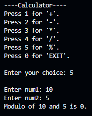

<h3>Q.1 Calculator</h3>

Develop a menu-driven program to implement arithmetic operations such as +, -, *, /, and % using UDF, switch case, and looping. Make sure that the program is endless until a certain letter is pressed.

ADDITION

SUBTRACTION

MULTIPLICATION

DIVISION

MODULO

EXIT

